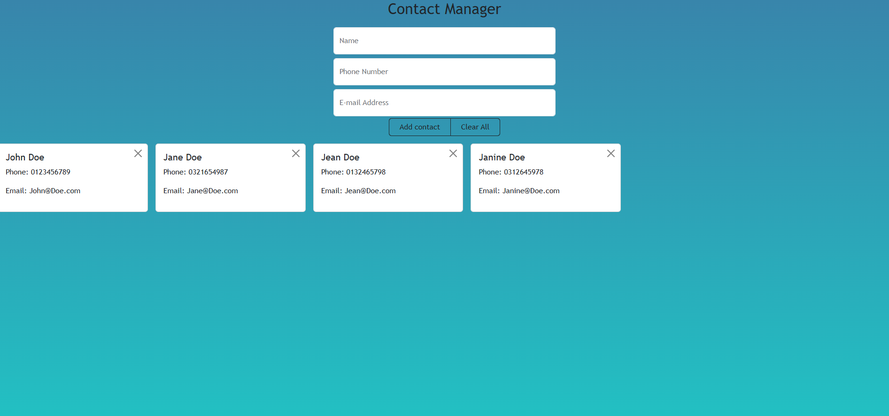

# 📇 Contact List App

A simple and responsive contact manager application built with vanilla JavaScript, Bootstrap, and `localStorage`. This app allows you to save and manage your contacts, with all data stored persistently in your browser.

---

## 📸 Preview

(This is the most important part! Be sure to take a screenshot of your finished app, add it to your project folder as `contact-list-screenshot.png`, and replace this text with the image!)



---

## ✨ Features

* **Add Contacts:** A simple form to add a new contact with their Name, Phone Number, and Email.
* **Persistent Storage:** All contacts are saved in the browser's `localStorage`, so they are saved even after closing the browser.
* **Display as Cards:** Contacts are displayed in a clean, responsive card layout using Bootstrap.
* **Delete Contacts:** Each contact card has a button to remove that contact from your list.
* **Empty State:** A message is displayed if no contacts are currently saved.
* **Input Validation:** The form checks to make sure you've filled out the required fields.

---

## 🛠️ Technologies Used

* **HTML5:** For the basic structure and forms.
* **Bootstrap 5:** For styling the UI, including the forms, buttons, and responsive card grid.
* **Vanilla JavaScript (ES6+):** For all application logic:
    * Handling form submission.
    * Managing data in an array of objects.
    * Saving to and retrieving from `localStorage`.
    * Dynamically generating the HTML for the contact cards.
* **Browser `localStorage` API:** For persisting the contact data.

---

## 🚀 How to Use

This project requires no build tools or dependencies. You can run it directly in your browser.

1.  Clone this repository (or download the files):
    ```bash
    git clone [https://github.com/your-username/your-repo-name.git](https://github.com/your-username/your-repo-name.git)
    ```
2.  Navigate to the project directory.
3.  Open the `index.html` file in your favorite web browser.

You can now start adding and managing your contacts!

---

## 💡 Future Improvements

This project is a great foundation. Here are a few ideas for how to expand it:

* **Edit Function:** Add an "Edit" button to each card to allow updating an existing contact's details.
* **Search/Filter:** Add a search bar to filter contacts by name.
* **Sort:** Add buttons to sort the contact list alphabetically by name.
* **Export/Import:** Add functionality to export the contact list as a JSON file and import it back.